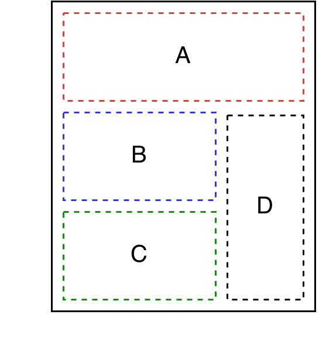
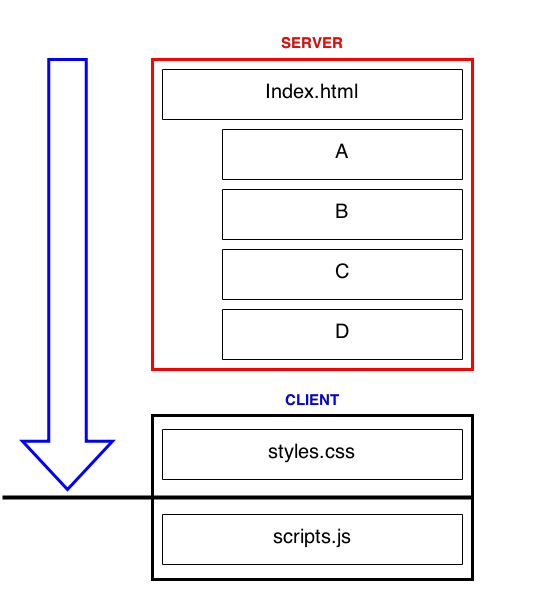
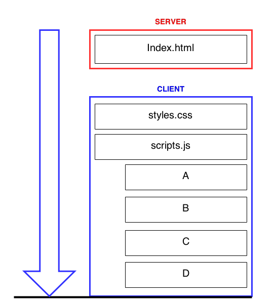

# Magma [](https://travis-ci.org/vilmosioo/magma)

### A new way of building web apps by taking advantage of both server and client side templating.

## Working Demo

[http://magma-vilmosioo.rhcloud.com/](http://magma-vilmosioo.rhcloud.com/)

A web-app that allows you to browse books and authors.

## Context

Complex websites have multiple sources to generate the data. A modular architecture allows you to aggregate different components before sending the final document to the user. Let's assume our website's wireframe looks like this. A, B, C, D are separate components built to display various data.



Server-side rendering is the common approach to deliver a document. A user makes a request, the server identifies the resources requested, builds the document and sends it back.



Client-side architecture works in a similar way, except the templating engine is the browser itself. The components are built by JavaScript.



Client vs server templating is an on-going debate today. Magma suggests a hybrid approach, taking the advantages of both and disadvantages of neither.

## How it works

Magma is not a framework. You don't need any code from this repository. it does not require you to use a particular tech stack.

It is an architecture. It leverages the main content to the server for fast delivery, while everything else is rendered on the client.

For example, referencing the wireframe above, your home page contains 4 components: A, B, C, D. On page load, the server will render A and B and send the document to the client. At this point the website is viewable and useful to the user. Once your JavaScript loads, components C and D are loaded using a client rendering engine. After this point the website behaves as a single page application. If you need to render A and B on the client later on, you may call their individual endpoints.
// example code from demo


**TLDR** Magma is an architecture that requires the main content to be delivered by the server on page load, and initialising a single page app as soon as JS is loaded. Components should be exposed by individual endpoints.

## Magma AngularJS module

```
npm install magma --save
```

```
bower install magma --save
```

### mgView

mgView directive allows you to delay route initialisation in your angular application. On `$routechangeSuccess` mgView will replace itself with the standard ngView and the application will behave as a regular SPA.

```
&lt;div mg-view&gt;
	Server side content that will only get updated after the first $onRouteChangeSuccess event
&lt;/div&gt;
```

### mgSubmit

To allow your forms to work before JS is loaded (or if a grievous error happened during bootstrap) you should include method and action attributes to it. This allows standard form functionality to work. As soon as angular is ready, mgSubmit will replace itself with the standard ngSubmit.

```
&lt;form action='URL' method='GET' mg-submit='onSubmit()'&gt;
	&lt;input type='text' name='model' ng-model='model'&gt;
	...
&lt;/form&gt;
```

### mgInclude & mgBind

The problem with ngInclude and ngBind is that they will replace your content immediately after bootstrap, even if data is already exist. mgInclude and mgBind allows you to display persistent server side content, until client side templateing is necessary.

```
&lt;div mg-include='template'&gt;
	Server side content that will be replaced only when template is defined to a truthy value.
&lt;/div&gt;
```

### mgScope

mgScope is a very simple directive that allows you to extend an element's scope using a stringified object.

```
&lt;div mg-scope='{numberOfResults: 10}'&gt;&lt;/div&gt;
```

In the example above, the element's scope will have a new property called numberOfResults that equals 10.

## Developers

To run the demo, first install it on your computer.

```
git clone https://github.com/vilmosioo/magma.git
cd magma
npm install && bower install
```

The following grunt tasks are made available

 * `grunt server` - Fires an express instance on port 9000 on your local machine, in development mode (CSS/JS is not minified, view caching disabled, angular debug mode is true).
 * `grunt dist` - Fires an express instance on port 9000 on your local machine, in production mode (CSS/JS is minified, view caching enabled, angular debug mode is false)
 * `grunt build` - Generates the artefacts.
 * `grunt test` - Runs the tests

## Demo roadmap

 - [x] Search books
 - [x] Paginate search results
 - [x] View individual book
 - [x] View similar books
 - [x] View author details
 - [ ] Sign-in with Goodreads
 - [ ] View your collection
 - [ ] Enable grid and list view

## Contributing

## Attributions

Kindly hosted by [Openshift](https://www.openshift.com/).
Data provided by [Goodreads](https://www.goodreads.com/).